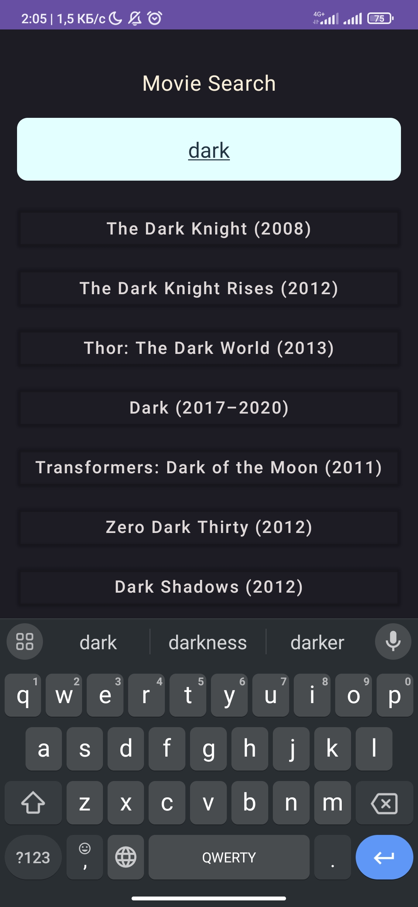
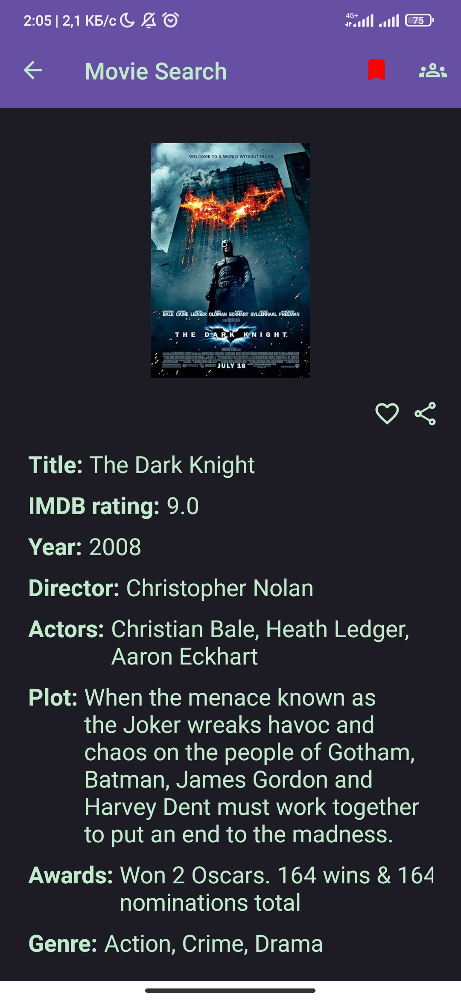
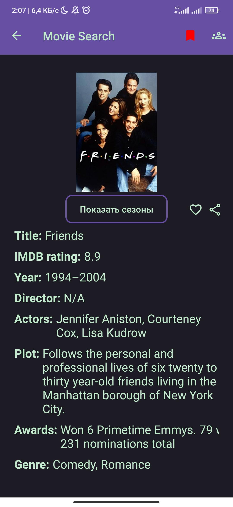
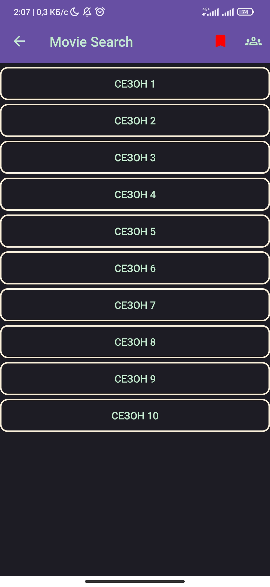
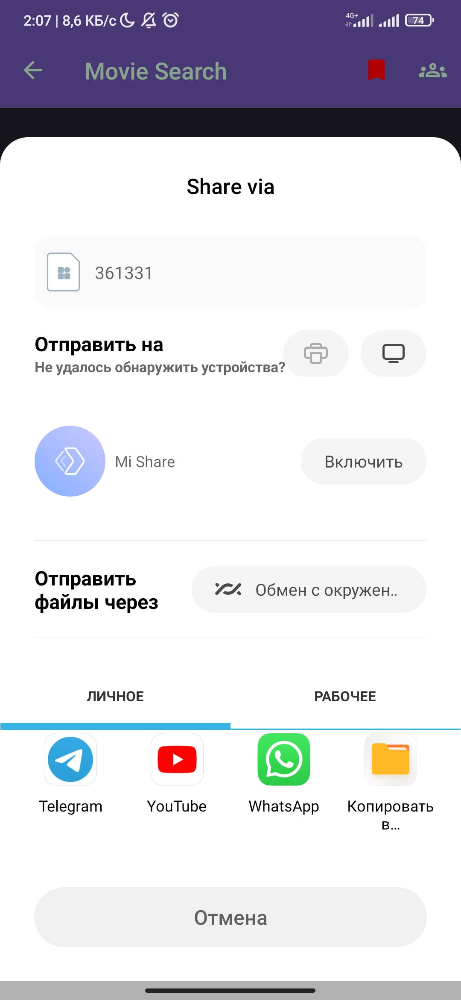

# MovieSearch!

**MovieSearch!** is a mobile application for movie and TV show enthusiasts that allows users to search for information using the OMDb API. The app provides features for adding movies and TV shows to favorites, viewing detailed episode information, and sharing movies with friends.

### Features:
- **Movie and TV show search** using the OMDb API.
- **Favorites list**: Add your favorite movies and TV shows for quick access.
- **Friend integration**: Add friends by email and share your favorite movies and TV shows with them in real time.
- **Detailed information**: View posters, episode details, and seasons for TV shows.
- **Real-time sync**: All data is synced in real-time across devices.
- **Multiplatform support**: Available on Android devices.

### Technologies used:
- **Kotlin** for modern, efficient development.
- **Jetpack Compose** for building some UI components.
- **Room Database** for local storage of favorite movies and shows.
- **Firebase Realtime Database** for real-time data synchronization with friends.
- **Retrofit** for network requests and interaction with the OMDb API.
- **Coroutines** and **Flow** for asynchronous operations and real-time data handling.

### Limitations:
- **English only**: The movie and TV show search feature is available only in English due to the limitations of the OMDb API.

---

**MovieSearch!** — это мобильное приложение для киноманов, позволяющее находить информацию о фильмах и сериалах с использованием OMDb API. Приложение предоставляет возможность добавлять фильмы и сериалы в избранное, просматривать подробную информацию о сезонах и эпизодах, а также делиться любимыми фильмами с друзьями.

### Возможности:
- **Поиск фильмов и сериалов** с использованием OMDb API.
- **Избранное**: Добавляйте любимые фильмы и сериалы в избранное для быстрого доступа.
- **Интеграция с друзьями**: Добавляйте друзей по email и делитесь с ними любимыми фильмами и сериалами в режиме реального времени.
- **Подробная информация**: Просматривайте постеры, детали эпизодов и сезонов для сериалов.
- **Реальная синхронизация**: Все данные синхронизируются между устройствами в реальном времени.
- **Поддержка Android**: Приложение доступно для устройств на Android.

### Использованные технологии:
- **Kotlin** для современного и эффективного программирования.
- **Jetpack Compose** для построения некоторых компонентов пользовательского интерфейса.
- **Room Database** для локального хранения избранных фильмов и сериалов.
- **Firebase Realtime Database** для синхронизации данных с друзьями в реальном времени.
- **Retrofit** для выполнения сетевых запросов и взаимодействия с OMDb API.
- **Coroutines** и **Flow** для обработки асинхронных операций и потоков данных в реальном времени.

### Ограничения:
- **Только английский язык**: Поиск фильмов и сериалов доступен только на английском языке из-за ограничений OMDb API.
-
## English

### Screenshots

- **Search Window (Compose)**  
  

- **Movie Information**  
  

- **TV Show Information**  
  

- **TV Show Seasons**  
  

- **Friend List Management Page**  
  

- **Ability to Share Movie Information with a Friend via Messengers**  
  

---

## Русский

### Скриншоты

- **Окно поиска (Compose)**  
  

- **Информация о фильме**  
  

- **Информация о сериале**  
  

- **Сезоны сериала**  
  

- **Страница управления списком друзей**  
  

- **Возможность отправки информации о фильме другу через Мессенджеры**  
  
